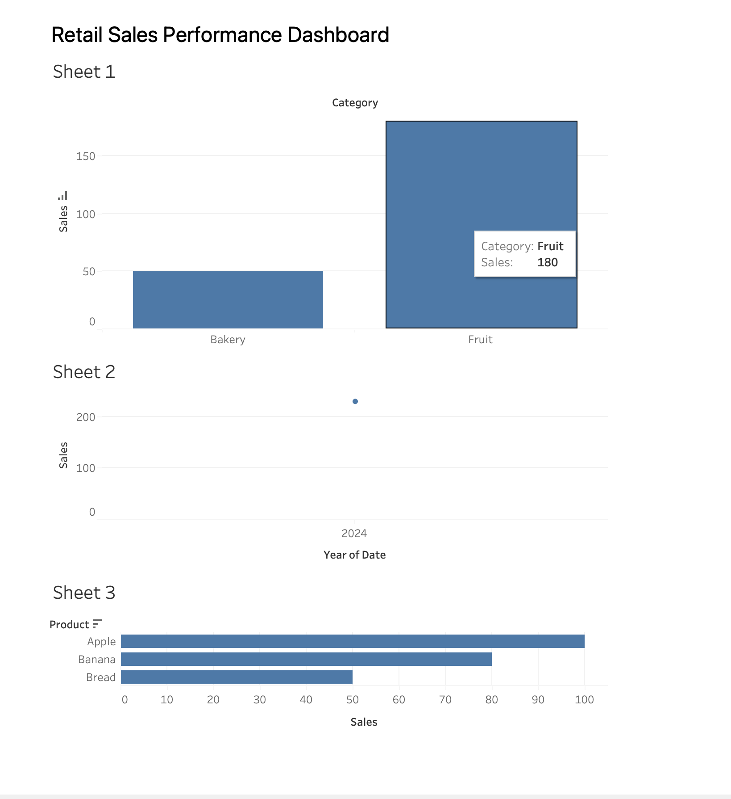

# Retail Sales Performance Analysis

## 📊 Project Overview
This project analyzes retail sales data to identify business performance trends, evaluate key performance indicators (KPIs), and generate insights to support data-driven decision-making.

---

## 🧰 Tools Used
- SQL (data querying and aggregation)
- Tableau (data visualization and insight analysis)
- Excel (data cleaning and preparation)

---

## 📈 Key Analysis
- Total sales by product category
- Identification of top-performing products
- Sales trends across time
- Basic performance comparison across categories

---

## 📊 Dashboard Preview



## 🧠 Sample SQL Queries

```sql
SELECT category, SUM(sales) AS total_sales
FROM retail_data
GROUP BY category;

SELECT product, SUM(sales) AS total_sales
FROM retail_data
GROUP BY product
ORDER BY total_sales DESC;
